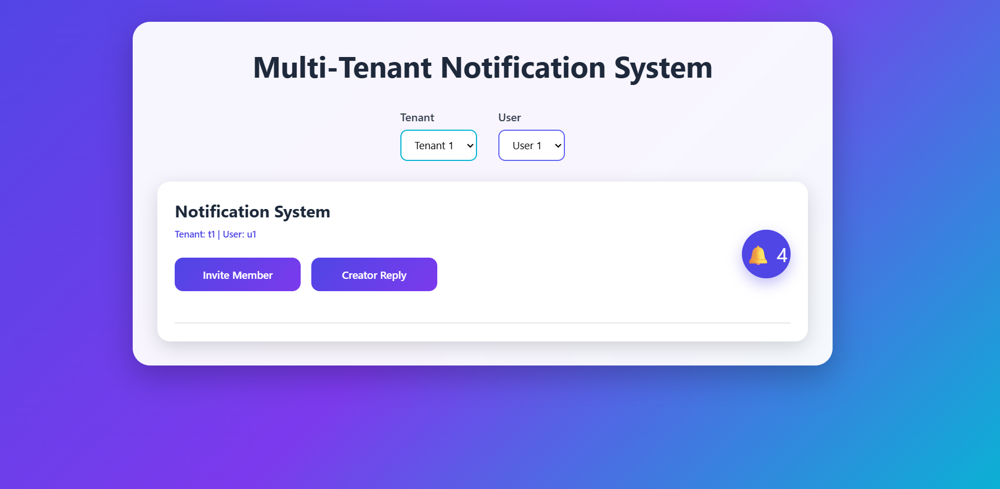

# Multi-Tenant Notification System

A full-stack Multi-Tenant Notification System built using **Node.js, Express.js, MongoDB Atlas, Mongoose, React (Vite), and Axios**. The application demonstrates how notifications can be created, retrieved, counted, and managed while maintaining complete tenant isolation.

---

# Project Overview

This project implements a Multi-Tenant Notification System where users can receive, manage, and monitor notifications while maintaining complete tenant isolation.

The backend provides RESTful APIs for notification management, while the frontend offers an interactive interface for switching tenants, simulating business events, viewing notifications, checking unread counts, and managing notification status.

Tenant isolation is implemented using request headers, ensuring that every tenant accesses only its own notifications.

---

# Features

## Backend

- Multi-tenant notification APIs
- Create notifications
- Retrieve notifications
- Retrieve unread notification count
- Mark notification as read
- Mark all notifications as read
- Business event trigger APIs
- Request-header based tenant and user identification
- MongoDB Atlas data persistence using Mongoose
- RESTful API architecture

## Frontend

- Responsive notification dashboard
- Notification Bell
- Notification List
- Unread notification counter
- Tenant selector (Tenant 1 / Tenant 2)
- User selector (User 1 / User 2)
- Business event simulation
  - Invite Member
  - Creator Reply
- Mark notification as read
- Mark all notifications as read
- Automatic polling every **10 seconds**
- Backend connection handling
- Empty state handling

---

# Technologies Used

## Backend

- Node.js
- Express.js
- MongoDB Atlas
- Mongoose
- REST APIs

## Frontend

- React
- Vite
- Axios

---

# Folder Structure

```text
notification-system
│
├── backend
│   ├── config
│   ├── controllers
│   ├── middleware
│   ├── models
│   ├── routes
│   ├── seed
│   ├── .env.example
│   ├── package.json
│   ├── package-lock.json
│   └── server.js
│
├── frontend
│   ├── public
│   ├── src
│   ├── components
│   ├── services
│   ├── package.json
│   ├── package-lock.json
│   ├── vite.config.js
│   ├── eslint.config.js
│   └── index.html
│
├── .gitignore
└── README.md
```

---

# Setup Instructions

## Clone Repository

```bash
git clone https://github.com/CODEWITHSOURAVBANERJEE26/notification-system.git
```

---

## Backend Setup

Navigate to the backend directory.

```bash
cd backend
```

Install dependencies.

```bash
npm install
```

Create a `.env` file.

```env
PORT=5000

MONGO_URI=your_mongodb_connection_string
```

An example configuration is available in:

```text
backend/.env.example
```

Start the backend server.

```bash
npm run dev
```

---

## Frontend Setup

Navigate to the frontend directory.

```bash
cd frontend
```

Install dependencies.

```bash
npm install
```

Start the frontend.

```bash
npm run dev
```

Open the URL displayed by Vite (typically `http://localhost:5173` or `http://localhost:5174`).

---

# API Endpoints

| Method | Endpoint | Description |
|---------|----------|-------------|
| GET | /notifications | Retrieve notifications |
| GET | /notifications/unread-count | Retrieve unread notification count |
| POST | /notifications | Create notification |
| PATCH | /notifications/:id/read | Mark notification as read |
| PATCH | /notifications/read-all | Mark all notifications as read |
| POST | /notifications/trigger/member-invited | Simulate Member Invitation event |
| POST | /notifications/trigger/creator-reply | Simulate Creator Reply event |

---

# Demo Features

<p align="center">
  
</p>

The application includes several demonstration features to showcase notification management.

- Switch between Tenant 1 and Tenant 2 directly from the user interface.
- Switch users within each tenant.
- Simulate business events using:
  - Invite Member
  - Creator Reply
- Notification Bell displays the unread notification count.
- Automatic polling refreshes notifications every **10 seconds**.
- Mark individual notifications as read.
- Mark all notifications as read.
- View notifications specific to the selected tenant and user.

---

# Tenant Isolation

Tenant isolation is implemented using request headers.

### Tenant 1

```
X-Tenant-Id: t1
X-User-Id: u1
```

### Tenant 2

```
X-Tenant-Id: t2
X-User-Id: u2
```

### Expected Behaviour

- Tenant 1 can access only Tenant 1 notifications.
- Tenant 2 can access only Tenant 2 notifications.
- Unread notification counts remain isolated between tenants.
- Mark Read affects only the selected tenant.
- Mark All Read affects only the selected tenant.
- Switching tenants from the frontend immediately reloads notifications for the selected tenant.

---

# Integration Write-up

In a production environment, this notification system would integrate with the application's existing authentication and authorization services instead of relying on manually supplied request headers.

Notification creation would be triggered automatically by business events such as member invitations, creator replies, report generation, or other application workflows. These events could originate from an event bus, message queue, or domain services.

The notification model, unread count logic, tenant filtering, and REST APIs would remain largely unchanged because they are independent of the authentication mechanism.

For production deployments, the system could be extended with centralized logging, monitoring, retry mechanisms, background workers, rate limiting, and real-time notification delivery using WebSockets or Server-Sent Events while maintaining compatibility with the existing REST APIs.

---

# What I Would Do Differently With More Time

If additional time were available, I would:

- Add search and filtering for notifications.
- Implement pagination for handling large notification datasets.
- Replace polling with real-time notifications using WebSockets.
- Implement JWT-based authentication and authorization.
- Add automated unit and integration tests.
- Improve validation and error handling.
- Add Docker support.
- Deploy the application to a cloud platform.
- Add monitoring, structured logging, and health checks.

---

# Author

**Sourav Banerjee**
